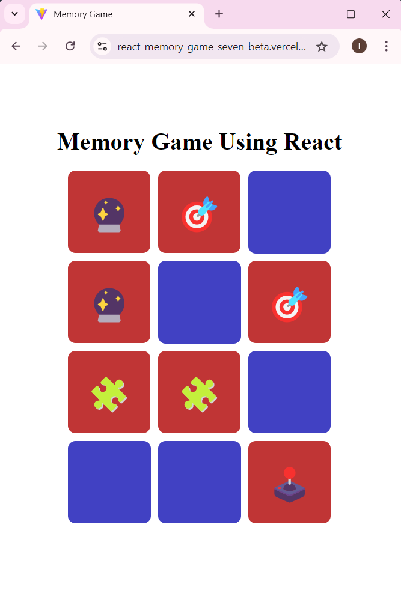

# react-memory-game

A fun and interactive memory game built with React.js, featuring a set of emoji cards that shuffle randomly on every game start. Match pairs of cards to solve the puzzle, and celebrate your win with confetti animations! This project demonstrates state management with React hooks, dynamic card flipping, and matching logic. [Click here to see the live demo](https://react-memory-game-seven-beta.vercel.app/).

